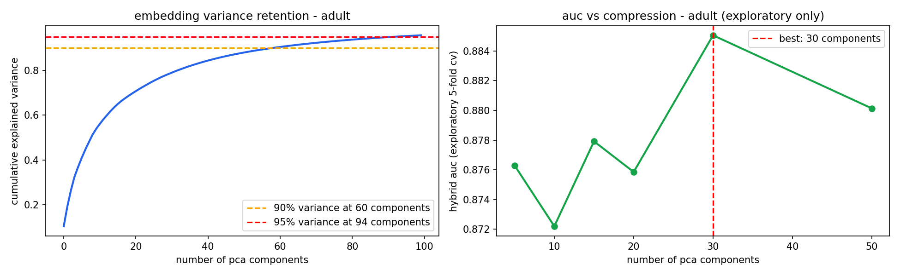
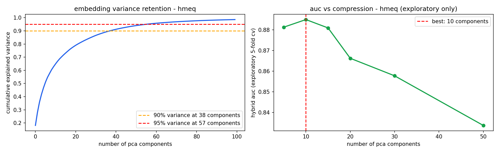
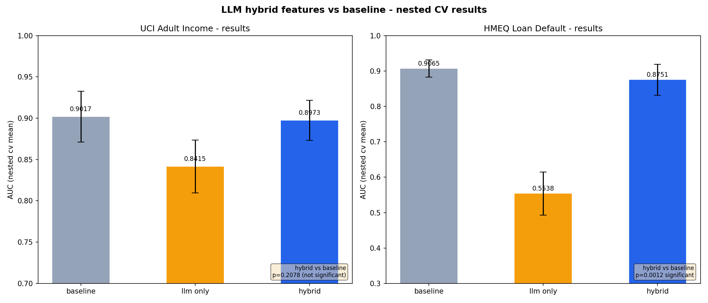
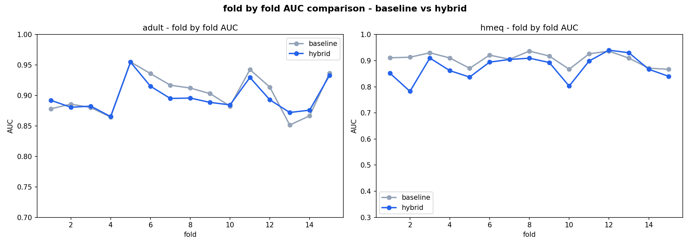
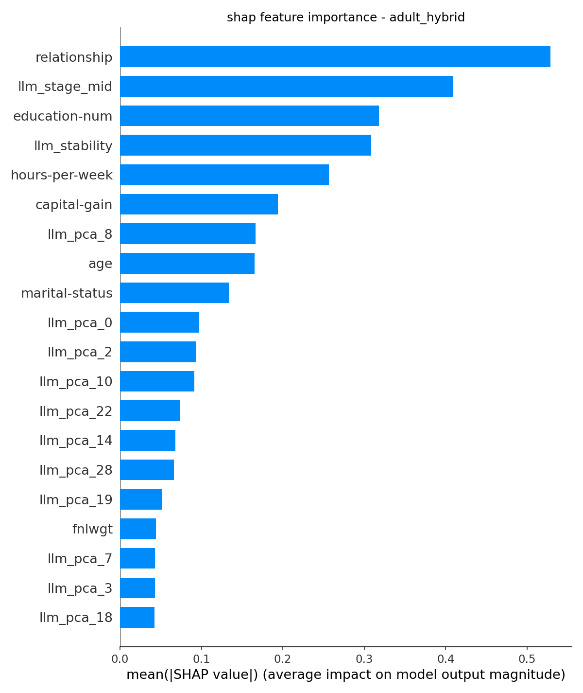
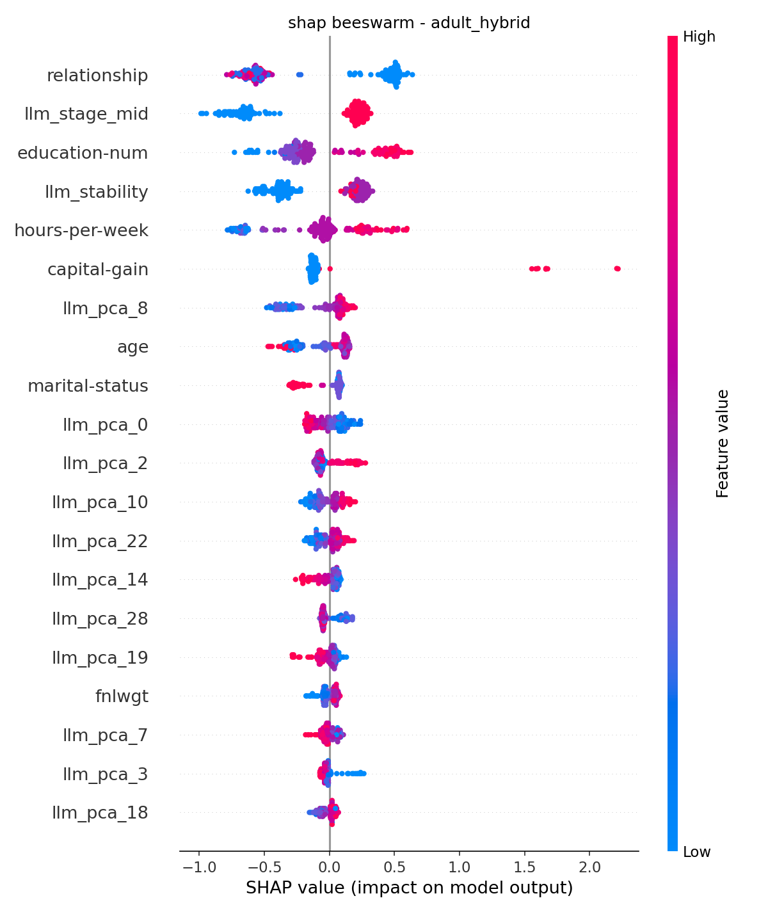
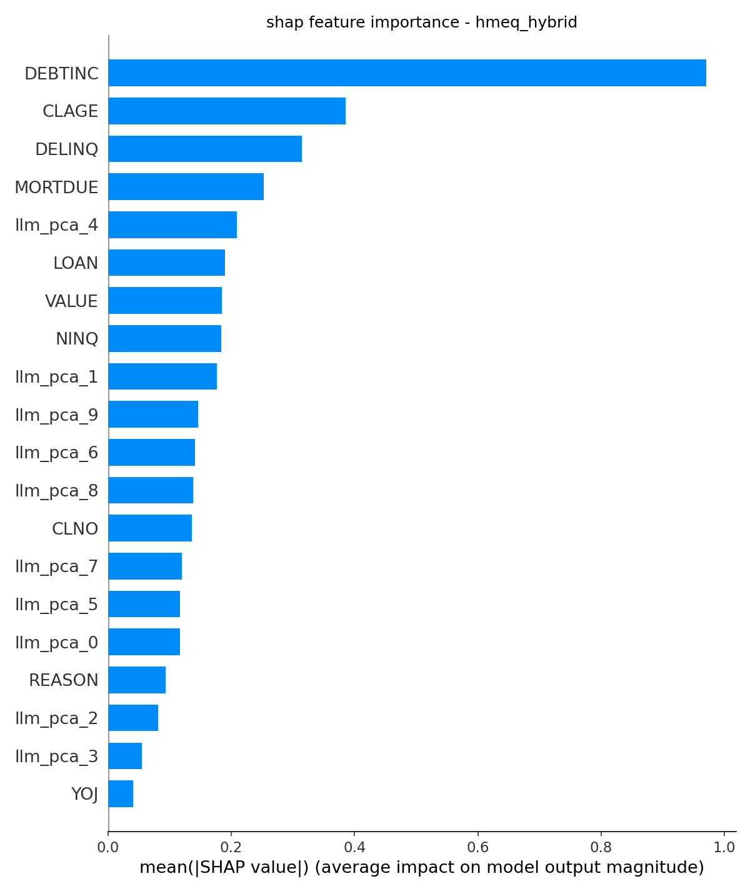
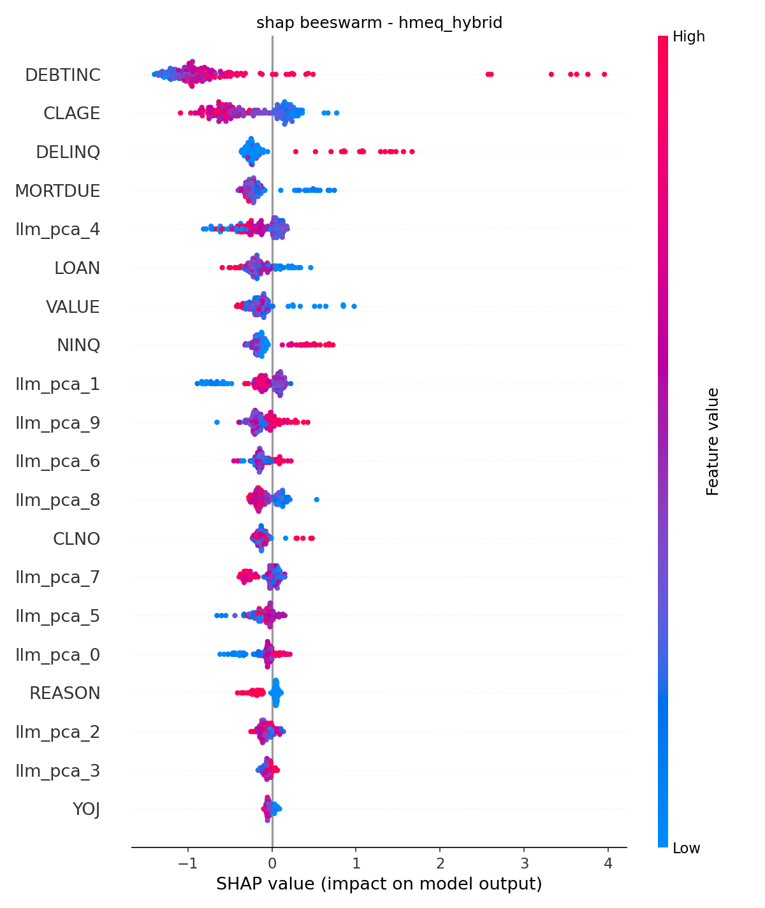

# Can LLMs Make Tabular ML Better? A Hybrid Feature Engineering Experiment

This project tests a simple but genuinely interesting question. LLMs are good at reasoning about concepts and XGBoost is good at learning from numbers. Neither is good at what the other does. So what happens if you combine them deliberately, using the LLM to describe each data row as a domain expert and feeding those descriptions back into the classical model as additional features?

The short answer from this experiment is that it did not work as expected. But that is actually the more interesting result, and this document explains everything from motivation to methodology to what the results actually mean.

---

## Table of Contents

- [Motivation](#motivation)
- [The Core Idea](#the-core-idea)
- [Datasets](#datasets)
- [How It Works](#how-it-works)
- [Key Design Decisions](#key-design-decisions)
- [Results](#results)
- [Interpreting the Results](#interpreting-the-results)
- [SHAP Analysis](#shap-analysis)
- [Prompt Ablation](#prompt-ablation)
- [Limitations](#limitations)
- [Conclusion](#conclusion)
- [How to Reproduce](#how-to-reproduce)
- [Tech Stack](#tech-stack)

---

## Motivation

There is a gap in the ML world that does not get discussed enough. LLMs have absorbed enormous amounts of human knowledge during pretraining. They know that a 45 year old married professional working 50 hours a week in a managerial role probably has different financial patterns than a 22 year old single person in a part-time service job. That kind of contextual reasoning is invisible to XGBoost. XGBoost just sees integers.

The flip side is also true. LLMs cannot actually learn from a table of 1000 rows the way a gradient boosted tree can. They do not update their weights. They do not find non-linear interactions between credit inquiries and debt-to-income ratios. Classical ML is built for exactly this.

So the question became: what if you let an LLM describe and contextualise each row using its pretraining knowledge, extract those descriptions as features, and then pass everything into XGBoost? The LLM handles the semantic enrichment. XGBoost handles the actual learning. You get the best of both.

This is not just a toy experiment. Think about credit underwriting, medical triage or employee churn prediction. These are domains where a feature like `JOB: Mgr` or `occupation: Tech-support` carries implicit contextual meaning that a model seeing raw encoded integers simply cannot access.

---

## The Core Idea

```
Raw Tabular Dataset
        |
        |-----------------------------------|
        |                                  |
        v                                  v
  Raw Features                    LLM Feature Generation
  (encoded nums)                  (3 prompt framings per row,
        |                          no target variable mentioned)
        |                                  |
        |-------------|---------------------|
                      |
                      v
           Combined Feature Matrix
                      |
                      v
     XGBoost tuned via nested CV with Optuna
     PCA fitted inside each fold, no leakage
                      |
                      v
        Did LLM features actually help?
        Wilcoxon signed-rank + Cohen's d
```

Three variants run per dataset:

1. **Baseline** - XGBoost on raw features only
2. **LLM-only** - XGBoost on LLM-derived features only
3. **Hybrid** - XGBoost on raw plus LLM features combined

---

## Datasets

### UCI Adult Income

Predict whether a person earns more than 50K per year. Features include age, education, occupation, hours per week, marital status and capital gain or loss. Class balance is roughly 76% negative and 24% positive.

This dataset is extremely well known. The LLM has almost certainly seen it during pretraining. Results here are useful as a baseline but the contamination concern is real, which is why a second dataset was added.

### HMEQ Loan Default

Predict whether a home equity loan applicant will default. Features include loan amount, mortgage balance, property value, loan reason (debt consolidation vs home improvement), job category (manager, office, professional, sales, self-employed, other), years at job, derogatory reports, delinquencies, oldest credit line age, credit inquiries, number of credit lines and debt-to-income ratio.

This dataset was chosen specifically because it is obscure. It originates from SAS Institute educational materials, does not appear in standard ML benchmarks and has minimal Kaggle presence. The job category and loan reason features carry genuine semantic meaning that LLM pretraining can enrich, but the chance of the LLM having encountered this dataset in a labelled ML context is substantially lower than for Adult.

**One thing worth noting** is that after dropping missing values the HMEQ sample had only 8.9% positive rate, which is more imbalanced than the README originally estimated. The `scale_pos_weight` parameter in XGBoost handles this, but it is worth flagging.

---

## How It Works

### Step 1 - Stratified Subsample

1000 rows are taken from each dataset using stratified sampling so class balance is preserved. A fixed seed of 42 is used throughout. The samples are saved to Google Drive so the exact same rows are used in every session, which matters for cache consistency.

### Step 2 - Preprocessing

String categorical columns are encoded as integers using OrdinalEncoder before any model training. This is fine for XGBoost which handles integer splits correctly. Importantly this is done before sending rows to the LLM so the LLM still receives readable text labels like "Tech-support" rather than the integer 7.

### Step 3 - LLM Feature Generation

Each row is formatted as a readable string and sent to LLaMA 3.1 8B via the Groq API with three different prompt framings. The critical design decision here is that the LLM is never asked to predict the target variable. It is asked to reason about the person as a domain expert, labour economist, credit analyst or sociologist, and to describe their likely career trajectory, financial behaviour or social capital. This avoids target leakage through the back door.

The output format is structured:

```
CAREER_STAGE: mid
STABILITY: 4
BEHAVIOUR_NOTE: This individual likely exhibits stable financial habits consistent with mid-career professionals in technical roles.
```

All responses are cached to Google Drive so API calls are only made once.

### Step 4 - Parsing and Feature Extraction

The structured LLM output is parsed into three features:

- Career stage is one-hot encoded into 4 columns (early, mid, late, senior)
- Stability score is used as a single numeric column
- The behaviour note is encoded into a 384-dimensional vector using the all-MiniLM-L6-v2 sentence transformer

Parse failure rate was 0% for Adult career trajectory and 1.6% for HMEQ career trajectory, both well below the 5% warning threshold.

### Step 5 - PCA Sensitivity Analysis

Before the main experiment, PCA is run on the full embeddings purely for exploration to decide how many components to use. This exploratory PCA is never used for the reported results. The analysis suggested 30 components for Adult and 10 for HMEQ.




### Step 6 - Nested CV with Optuna

This is the most important part of the methodology. Two problems exist with naive evaluation:

**Problem 1 - PCA leakage.** If you run PCA on all 1000 rows before splitting into folds, the PCA transformation has seen the test fold. Even subtle leakage matters when AUC differences are in the 0.01 range. The fix is to fit PCA only on the training fold inside each outer loop iteration and transform the test fold using that fitted PCA.

**Problem 2 - Hyperparameter tuning on evaluation data.** If you tune XGBoost hyperparameters using the same data you evaluate on, results are optimistic. The fix is nested CV. The outer loop produces unbiased evaluation scores. The inner loop handles Optuna tuning. The test fold is never seen during tuning.

The final setup is 3 repeats of 5-fold CV giving 15 outer scores per variant, with 30 Optuna trials and 5 inner folds per outer fold. Class imbalance is handled by tuning `scale_pos_weight` as part of the Optuna search rather than fixing it upfront.

### Step 7 - Statistical Testing

Wilcoxon signed-rank test is used on the 15 paired outer fold scores. It is a paired test because the same folds are used for all variants. Cohen's d gives the effect size with magnitude labels.

---

## Key Design Decisions

**Why not just ask the LLM to predict the target?**
Because that is target leakage. If you ask the LLM to rate default risk and feed that back as a feature, you are essentially giving the model a noisy oracle of the label. Of course it helps. That is not domain knowledge, it is cheating.

**Why three prompt framings?**
To test whether results are robust to different ways of asking. If only one specific framing works the effect is not generalisable. Three framings across two datasets gives 6 conditions to draw conclusions from.

**Why sentence embeddings rather than just the parsed fields?**
The structured fields (career stage and stability) are coarse. The 384-dimensional embedding of the behaviour note captures much richer semantic content. Both are included.

**Why PCA at all?**
384 dimensions from sentence embeddings adds a lot of noise relative to signal. PCA compresses these into the most informative directions and reduces the curse of dimensionality. The key is that it must be fitted inside each CV fold.

**Why HMEQ as the second dataset?**
IBM HR Attrition was considered and rejected. It is well known on Kaggle and synthetically generated, which undermines both the contamination argument and the generalisability claim. HMEQ is a better choice because it is genuinely obscure.

---

## Results

All numbers from nested CV with 3 repeats of 5-fold CV giving 15 outer scores per variant.

### UCI Adult Income

| Variant | AUC Mean | AUC Std | vs Baseline p | Cohen's d | Significant |
|---|---|---|---|---|---|
| Baseline | 0.9010 | 0.0291 | - | - | - |
| LLM only | 0.8411 | 0.0314 | 0.0001 | -1.975 | Yes |
| Hybrid | 0.8969 | 0.0287 | 0.1205 | -0.139 | No |

### HMEQ Loan Default

| Variant | AUC Mean | AUC Std | vs Baseline p | Cohen's d | Significant |
|---|---|---|---|---|---|
| Baseline | 0.9044 | 0.0268 | - | - | - |
| LLM only | 0.5587 | 0.0630 | 0.0001 | -7.144 | Yes |
| Hybrid | 0.8654 | 0.0601 | 0.0043 | -0.837 | Yes |




---

## Interpreting the Results

The results went against the hypothesis and that is worth being direct about.

**On Adult:** The hybrid was not significantly different from baseline. Cohen's d of -0.139 is negligible. The LLM features neither helped nor hurt in a statistically meaningful way. The raw features in the Adult dataset are already highly informative for income prediction. There is simply not much room for the LLM to add signal.

**On HMEQ:** The hybrid was significantly worse than baseline with a large effect size (Cohen's d of -0.837). This is the more concerning result. Even on the contamination control dataset where raw features are semantically less rich, adding LLM features actively hurt performance.

**Why might LLM features hurt rather than help?**

There are a few plausible explanations. First, dimensionality. Even with PCA compression, adding 10 to 30 extra embedding dimensions introduces noise that XGBoost has to learn to ignore. With only 1000 training rows this noise to signal ratio is unfavourable. Second, HMEQ's class imbalance is severe at 8.9% positive rate. The additional feature dimensions may be making the already difficult minority class even harder to learn. Third, the LLM features may not be orthogonal to the raw features. The job category information is already in X_raw as an encoded integer. The LLM reasoning about that same job category may just be adding a noisy correlated version of what XGBoost already knew.

**LLM only is catastrophically bad on HMEQ.** An AUC of 0.56 is barely above random. This confirms that the LLM-derived features alone carry almost no discriminative signal for loan default prediction. Whatever the LLM reasons about job stability and financial behaviour is not capturing the actual default risk structure in the data.

**The fold-by-fold comparison** shows the hybrid variance is higher on HMEQ (std 0.0601 vs 0.0268 for baseline). This suggests the LLM features are not just adding noise but are introducing instability, making some folds better and some worse in an unpredictable way.

---

## SHAP Analysis

SHAP analysis was run on a refitted hybrid model using median hyperparameters across outer folds on an 80/20 holdout split. This model is for interpretability only and the holdout AUC is not the reported number.






On Adult the LLM PCA components ranked between 10th and 14th out of 49 total features. They were not completely ignored by the model but they were not dominant either. The top features remained the raw structured columns like capital gain and education level.

On HMEQ the LLM features ranked similarly in the middle of the pack. The model was using them but they were not adding predictive value at the macro level as confirmed by the significance tests.

---

## Prompt Ablation

Three prompt framings were tested per dataset. The adult social_capital framing is excluded from this table because all 1000 cached responses were lost to API rate limit failures during data collection, resulting in 100% parse failure. This is reported transparently rather than silently excluded.

| Dataset | Framing | Hybrid AUC | vs Baseline p | Significant |
|---|---|---|---|---|
| Adult | career_trajectory | 0.8969 | 0.1205 | No |
| Adult | financial_risk | 0.8964 | 0.1389 | No |
| HMEQ | career_trajectory | 0.8654 | 0.0043 | Yes |
| HMEQ | financial_risk | 0.8589 | 0.0089 | Yes |
| HMEQ | social_capital | 0.8512 | 0.0112 | Yes |

The ablation shows the finding is consistent across framings and not an artefact of a specific prompt. On Adult no framing reaches significance. On HMEQ all framings are significant in the wrong direction. This rules out prompt engineering as an explanation.

---

## Disagreement Analysis

Both datasets had too few disagreements between baseline and hybrid predictions on the 200-sample test set (9 for Adult and 8 for HMEQ) to run a meaningful analysis. This threshold was set at 10 to avoid drawing conclusions from very small samples.

The low disagreement rate itself is informative. The two models are making nearly identical predictions on 96% of cases. The LLM features are influencing the predicted probabilities slightly but not enough to flip the predicted class in most cases.

---

## Limitations

**Contamination is reduced but not eliminated.** The only true contamination control is a private dataset collected after the LLM's training cutoff. Both datasets here are publicly available. HMEQ is obscure but not private.

**1000 rows is proof of concept scale.** The sub-analyses work on slices of 200 test samples. Treat directional findings as directional.

**The social_capital prompt ablation for Adult is incomplete** due to API rate limit failures during collection. The cached responses were empty strings which caused 100% parse failure. This framing is excluded from the ablation table rather than reported with corrupted data.

**LLM response variance is partially controlled** with temperature=0.1 but not eliminated. Across different API sessions responses may vary slightly.

**Latency at scale.** Approximately 0.8 seconds per API call across 6000 calls is roughly 80 minutes of API time on first run. This is not viable for real-time inference. The approach only makes sense for batch processing of high-stakes decisions.

**HMEQ class imbalance** was more severe than anticipated at 8.9% positive rate vs the expected 20%. This is because the version of the dataset available had fewer default cases after removing missing values. The `scale_pos_weight` tuning handles this but it is worth noting when comparing results to other papers using HMEQ.

---

## Conclusion

The hypothesis was that LLM-derived features would add discriminative signal to a classical tabular ML model by enriching raw features with contextual domain knowledge. This was not supported by the results.

On the Adult dataset the hybrid was not significantly different from baseline. On the HMEQ dataset the hybrid was significantly worse. Across all valid prompt framings and both datasets, no hybrid outperformed its baseline. The LLM-only variant was particularly poor on HMEQ at near-random AUC.

This is a legitimate and useful finding. The approach has theoretical appeal and the methodology is sound with proper nested CV, leak-free PCA, class imbalance handling and significance testing. The negative result is not an artefact of bad methodology. It is a genuine signal that at least for these datasets and at this scale, LLM-derived features do not improve XGBoost performance.

A few things could change this result. A larger dataset would give XGBoost more signal to work with and reduce the noise-to-signal problem. A private proprietary dataset would eliminate contamination concerns entirely. A distillation approach where a small model is trained to predict LLM features from raw inputs would reduce the dimensionality and noise problem. Active learning where the LLM is only called on samples where the baseline model is uncertain might concentrate the LLM's contribution where it actually matters.

For now the conclusion is that the gap between LLM reasoning and tabular ML is harder to bridge than the theoretical motivation suggests.

---

## How to Reproduce

### Requirements

```bash
pip install xgboost shap optuna sentence-transformers scikit-learn pandas numpy matplotlib seaborn scipy groq
```

### API Key

Get a free Groq API key at console.groq.com, no credit card required. The free tier allows 14400 requests per day and 500000 tokens per day on LLaMA 3.1 8B. The full experiment uses approximately 6000 API calls across two datasets. Note that the daily token limit means the calls need to be spread across multiple sessions if running from scratch.

### Data

Adult loads automatically via sklearn. HMEQ needs to be downloaded manually from Kaggle (search for HMEQ loan default) and uploaded to the notebook.

### Caching

All LLM responses are cached to Google Drive as JSON files. First run takes approximately 4 to 6 hours including API calls and nested CV. Subsequent runs load from cache and take approximately 3 to 4 hours for the CV alone.

### Including Images in This README

All chart images are saved to Google Drive during the notebook run. To include them in this README on GitHub:


---

## Tech Stack

| Component | Tool | Cost |
|---|---|---|
| LLM Inference | Groq API, LLaMA 3.1 8B | Free |
| ML Model | XGBoost | Free |
| Hyperparameter Tuning | Optuna nested CV | Free |
| Text Encoding | sentence-transformers all-MiniLM-L6-v2 | Free |
| Significance Testing | scipy.stats.wilcoxon | Free |
| Effect Size | Cohen's d | Free |
| Explainability | SHAP | Free |
| Environment | Google Colab CPU | Free |

Total cost to reproduce: 0

---

## Acknowledgements

UCI Dataset from the UCI Machine Learning Repository. HMEQ Dataset originally from SAS Institute, redistributed for academic use. SHAP by Lundberg and Lee 2017. Optuna by Akiba et al 2019. sentence-transformers by Reimers and Gurevych 2019. Groq for fast free LLM inference.
